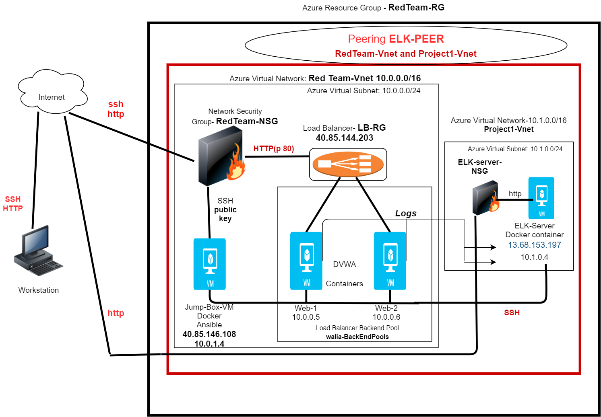

## HarmanWalia
part of Project1 completed during the Cybersecurity bootcamp in 2020-21
## __Automated ELK Stack Deployment__

The files in this repository were used to configure the network depicted below.

These files have been tested and used to generate a live ELK deployment on Azure. They can be used to either recreate the entire deployment pictured above. Alternatively, select portions of the playbook file may be used to install only certain pieces of it, such as Filebeat.

[Filebeat Playbook](Ansible/filebeat-playbook.yml)
	
__This document contains the following details:__
- Description of the Topology
- Access Policies
- ELK Configuration
- Beats in Use
- Machines Being Monitored
- How to Use the Ansible Build

### Description of the Topology

The main purpose of this network is to expose a load-balanced and monitored instance of DVWA, the Damn Vulnerable Web Application.

Load balancing ensures that the application will be highly available, in addition to restricting overloading of traffic to the network.

__Security Aspect of load balancers__

Load Balancer is secure by default and is part of the virtual network which is a private and an isolated network. It helps protect the private network with its in-built *Network Address Translation(NAT)* capability thus preventing the VMs from any outside attacks.

__Advantage of a jump box__

It is highly secured and hardened system that acts as an interface between a firewall and an internal network. The user needs to be authenticated by the jumpbox before it can access the private network. This help decrease the ability of hackers or their malware creations to steal admin credentials and take over an environment.

Integrating an ELK server allows users to easily monitor the vulnerable VMs for changes to the network and system logs.

__Filebeat__

Filebeat is installed as an agent on the system and it monitors the specified log files or locations, collects log events, and forwards them either to Elasticsearch or Logstash for indexing.

__Metricbeat__

Metricbeat takes the metrics and statistics that it collects and ships them to the specified output such as Elasticsearch or Logstash.

##The configuration details of each machine may be found below.

| Name        | \|Function      | IP Address                               | Operating System |
|-------------|---------------- |----------------------------------------- |------------------|
|  Jump Box   | Gateway         | 10.0.1.4(Private)//40.85.146.108(Public) | Linux            |
|  Web-1      | Virtual Machine | 10.0.0.5(Private)                        | Linux            |
|  Web-2      | Virtual Machine | 10.0.0.6(Private)                        | Linux            |
|  ELK-Server | Virtual Machine | 10.1.0.4(Private)//13.68.153.197(Public) | Linux            |

### Access Policies
The machines on the internal network are not exposed to the public Internet.

Only the Jump-Box-Provisioner machine can accept connections from the Internet.

Access to this machine is only allowed from the following IP addresses __99.234.136.232 (workstation IP address)__

Machines within the network can only be accessed by __Jump-Box-Provisioner.__ 

The same machine is allowed to access the ELK VM. Its Private IP address is 10.0.1.4/16

## A summary of the access policies in place can be found in the table below.

| Name       | Publicly Accessible | Allowed IP Addresses |
|------------|---------------------|----------------------|
| Jump Box   | Yes                 | 99.234.136.232       |
| Web-1      | No                  | 10.0.1.4             |
| Web-2      | No                  | 10.0.1.4             |
| ELK-Server | No                  | 10.0.1.4             |

### Elk Configuration

Ansible was used to automate configuration of the ELK machine. No configuration was performed manually, which is advantageous because:
* The usage of YAML playbooks help with the configuration of the complex and multi-tier IT environment.
* Ansible was able to provision various packages and dependencies on multiple Virtual Machines with the help of a YAML playbook saving significant amount of time and    
  resources. 
* In our project We were able to configure DVWA(Dmn Vulnerable Web Application) and ELK stack on different VMs  with the help of these playbooks.

The ELK installation playbook [Install-ELK](Ansible/install-elk.yml) is created as follows:

. From the Ansible container, created a new playbook: install-elk.yml

	. The header of the playbook specified `elk` as the target hosts, it was updated
	   on Ansible hosts file.
		
	. The following tasks were added to the playbook file:

		. Set the `vm.max_map_count` to `262144` so the target VM, ELK-Server to use more memory.
		  The ELK container will not run without this setting.

		. Installed the following `apt` packages:

		    . `docker.io`: The Docker engine, used for running containers.
		    . `python3-pip`: Package used to install Python software.

		. Installed the following `pip` packages:

  		    . `docker`: Python client for Docker, required by Ansbile to control the state of
		       Docker containers.

		. Downloaded the Docker container called `sebp/elk:761`. `sebp` is the organization that 
		  made the container. `elk` is the container and `761` is the version.

		. Configured the container to start with the following port mappings:
			- `5601:5601`
			- `9200:9200`
			- `5044:5044`

   		. Executed the install-ELK.yml with command “ansible -playbook install-ELK.yml”. 

		. Started the container. Verified the connection to the ELK stack container by "docker ps" command.
	

The following screenshot displays the result of running `docker ps` after successfully configuring the ELK instance.

### Target Machines & Beats
This ELK server is configured to monitor the following machines:

List of the IP addresses of the machines being monitored:

__Web-1 : 10.0.0.5__

__Web-2 : 10.0.0.6__

We installed installed the following Beats on these machines:

[__Filebeat__](Ansible/filebeat.PNG)

[__Metricbeat__](Ansible/metricbeat.PNG)

These Beats allow us to collect the following information from each machine:

•	Filebeat is used to collect log files  like audit logs, deprecation logs, server logs, from specific files on remote machines.

•	Examples of Filebeats can be logs that are generated by Apache, Microsoft Azure tools, the Nginx web server, and MySQl databases.

•	Metricbeat collects machine metrics.

•	It is simply a measurement to tell analysts how healthy it is.

•	Examples of Metricbeat can be CPU usage/Uptime, number of users visited the web server etc.

## __Using the Playbook__

In order to use the playbook, you will need to have an Ansible control node already configured. Assuming you have such a control node provisioned: 

SSH into the control node and follow the steps below:
- Copy the [Filebeat Configuration](Ansible/filebeat-config.yml) file to /etc/ansible/files.
- Update the filebeat-config.yml file to include IP address of the ELK-Server on line 1106 and 1806.
- Edit the /etc/ansible/hosts file to include the IP addresses of the Webservers where filebeat agent need to be installed.
  The IP addresses of Web-1 and Web-2 (10.0.0.5 and 10.0.0.6)
- Create the playbook file [Filebeat Playbook](Ansible/filebeat-playbook.yml) under `/etc/ansible/roles and execute it.
- Verify the successful execution of the playbook, navigate to http://[ELK-Server IP]:5601/app/kibana to check that the filebeat installation worked as expected.
- You can click “Check Data” under Home --> Add Data --> System Logs --> Module Status. It should say  [“ Data successfully received form this module”](Ansible/filebeat.PNG)

## __Metricbeat Installation__

- Copy the  [Metricbeat Configuration file](Ansible/metricbeat-config.yml) to /etc/ansible/files.
- Update the metricbeat-config.yml file to include IP address of the ELK-Server on line 1106 and 1806.
- Edit the [/etc/ansible/hosts](Ansible/hosts.png) file to include the IP addresses of the Webservers where metricbeat agent need to be installed.
- Create the playbook file filebeat-playbook.yml under `/etc/ansible/roles and execute it.
- Verify the successful execution of the playbook, navigate to http://[ELK-Server IP]:5601/app/kibana to check that the metricbeat installation worked as expected.
- On the Metricbeat Installation Page in the ELK server GUI, scroll to **Step 5: Module Status** and click **Check Data*. It should say  [“ Data successfully received form this module”](Ansible/metricbeat.PNG)

